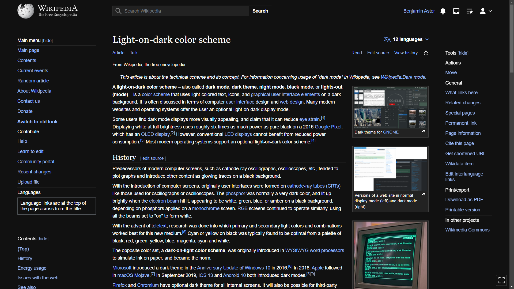
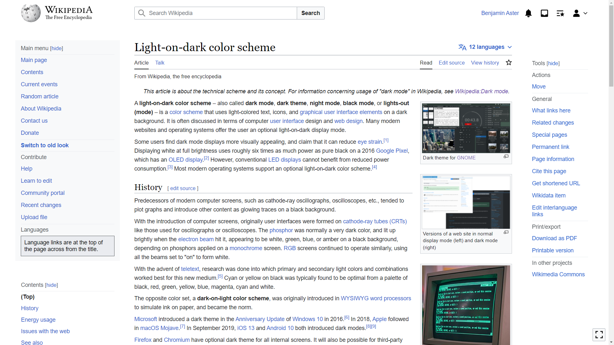

# Wikipedia Dark Mode

A dark mode for Wikipedia

> [!NOTE]
> The English Wikipedia has now added experimental support for dark mode, making this project somewhat obsolete. However, some non-English Wikipedias (e.g. the German one) don't have native dark mode support yet, so this project is still useful for them.

<table>
<tbody>
<tr>
<td>
<figure>

<figcaption>
Dark mode
</figcaption>
</figure>
</td>
<td>
<figure>

<figcaption>
Light mode
</figcaption>
</figure>
</td>
</tr>
</tbody>
</table>

## How to enable

1. Log in to your Wikipedia account.
1. Go to Preferences.
1. Go to the "Gadgets" tab.
1. In the "Appearance" section, enable "Dark Mode toggle: Enable a toggle for using a light text on dark background color scheme".
1. Click "Save".
1. Go to the "Appearance" tab.
1. Make sure "Vector (2022)" is chosen as the skin.
1. Click on "Custom CSS" next to "Vector (2022)".
1. Click on "Edit source".
1. Paste the CSS from [style.css](./style.css) into the code box.
1. Write something like "Edit vector-2022.css" into the edit summary, click "This is a minor edit" and publish the changes.
1. Ignore the Warning of Wikipedia's outdated CSS parser and click "OK".
1. That's it! In your account dropdown menu, you now have a "Dark mode"/"Light mode" toggle.

